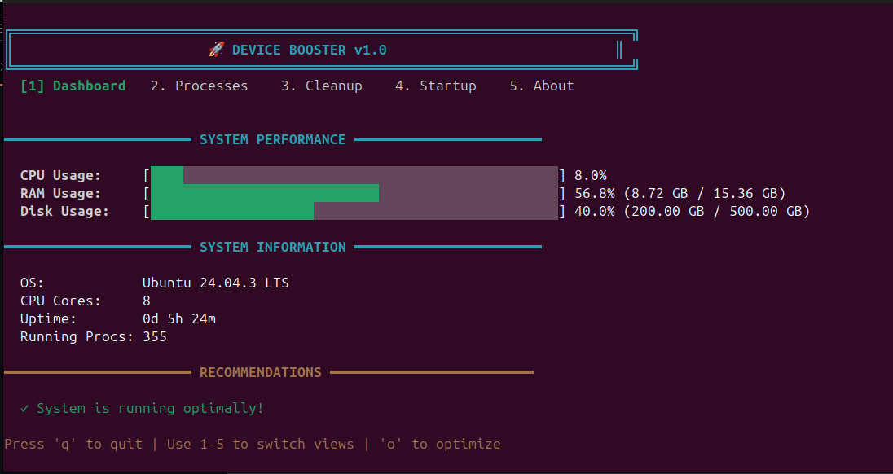

# 🚀 Booster - Terminal-Based System Optimizer

[](LICENSE)
[](https://ziglang.org/)
[](https://github.com/MythicalMAxX/Booster)

A powerful, cross-platform terminal-based device booster written in Zig. Monitor system performance, manage processes, clean junk files, and optimize your device—all from your terminal.



## ✨ Features

### 📊 Real-Time System Monitoring
- **CPU Usage**: Monitor processor utilization with color-coded progress bars
- **RAM Usage**: Track memory consumption and available memory
- **Disk Usage**: View storage capacity and free space
- **System Information**: OS details, CPU cores, uptime, and running processes

### 🔍 Process Management
- View top resource-consuming processes
- Real-time CPU and memory usage per process
- Sort by resource usage
- Color-coded warnings for high-usage processes

### 🧹 Intelligent Cleanup
- **Temporary Files**: Clean system temp directories
- **Cache Files**: Remove application caches
- **Log Files**: Cleanup old log files (with safety checks)
- Shows space analysis before cleanup

### ⚡ Performance Optimization
- One-click system optimization
- Memory cleanup and optimization
- Junk file removal
- System health recommendations

### 🎨 Modern Terminal UI
- Clean, intuitive interface
- Color-coded status indicators
- Progress bars for resource usage
- Keyboard-driven navigation
- Cross-platform ANSI support

## 🚀 Quick Start

### Prerequisites

- **Zig 0.15.0** or later ([Download](https://ziglang.org/download/))
  - **Note**: Tested and verified with Zig 0.15.2
- Terminal with ANSI color support

### Installation

#### From Source

```bash
# Clone the repository
git clone https://github.com/MythicalMAxX/Booster.git
cd Booster

# Build the project
zig build -Doptimize=ReleaseFast

# Run the application
./zig-out/bin/booster
```

#### Install to System

```bash
# Build and install
zig build -Doptimize=ReleaseFast
sudo cp zig-out/bin/booster /usr/local/bin/

# Run from anywhere
booster
```

### Platform-Specific Notes

#### Linux
- Full feature support
- Some features require elevated permissions (run with `sudo`)
- Tested on Ubuntu 20.04+, Fedora 35+, Arch Linux

#### macOS
- Full feature support
- May require granting terminal permissions
- Tested on macOS 11.0+

#### Windows
- Core features supported
- Run as Administrator for full functionality
- Requires Windows 10 or later
- Use Windows Terminal for best experience

## 📖 Usage

### Basic Commands

```bash
# Start Booster
booster

# Navigation
1 - Dashboard (System Performance)
2 - Processes (Top Processes)
3 - Cleanup (Junk File Analysis)
4 - Startup (Startup Programs)
5 - About

# Actions
o - Optimize/Clean System
q - Quit Application
```

### Dashboard View

The dashboard displays:
- CPU usage with real-time percentage
- RAM usage (used/total) with percentage
- Disk usage (used/total) with percentage
- System information (OS, CPU cores, uptime)
- Smart recommendations based on system state

### Process View

Monitor resource usage:
- PID and process name
- CPU percentage
- Memory usage in MB
- Color-coded warnings (red >50%, yellow >20%)

### Cleanup View

Analyze disk space:
- Temporary files size
- Cache files size
- Log files size
- Total recoverable space
- Safe cleanup with one command

### Optimization

Press `o` to run full system optimization:
1. Clean junk files
2. Optimize memory
3. System health check

## 🏗️ Architecture

### Project Structure

```
booster/
├── src/
│   ├── main.zig          # Entry point
│   ├── tui.zig           # Terminal UI implementation
│   ├── monitor.zig       # System monitoring (cross-platform)
│   └── optimizer.zig     # Optimization and cleanup
├── build.zig             # Build configuration
├── README.md             # Documentation
└── LICENSE               # MIT License
```

### Module Overview

#### `main.zig`
Application entry point and initialization.

#### `tui.zig`
- Terminal UI rendering
- Input handling
- View management
- Color and style utilities
- Raw mode terminal control

#### `monitor.zig`
Cross-platform system monitoring:
- CPU usage calculation
- Memory statistics
- Disk usage analysis
- Process enumeration
- System information gathering

#### `optimizer.zig`
System optimization features:
- Junk file detection and cleanup
- Memory optimization
- Disk usage analysis
- Safe file operations

## 🛠️ Development

### Building

```bash
# Debug build
zig build

# Release build (optimized)
zig build -Doptimize=ReleaseFast

# Run directly
zig build run

# Run tests
zig build test
```

### Testing

```bash
# Run all tests
zig build test

# Run with verbose output
zig build test -- --verbose
```

### Code Style

- Follow Zig standard formatting (`zig fmt`)
- Use meaningful variable names
- Add comments for complex logic
- Keep functions focused and small
- Handle errors explicitly

### Contributing

Contributions are welcome! Please:

1. Fork the repository
2. Create a feature branch (`git checkout -b feature/amazing-feature`)
3. Format code (`zig fmt`)
4. Run tests (`zig build test`)
5. Commit with conventional commits (`feat: add amazing feature`)
6. Push to branch (`git push origin feature/amazing-feature`)
7. Open a Pull Request

## 🔒 Security & Safety

### Safe Operations

Booster implements multiple safety measures:

- **Read-only analysis**: Initial scans don't modify files
- **User confirmation**: Optimization requires explicit action
- **System file protection**: Critical files are never touched
- **Permission checks**: Validates access before operations
- **Error handling**: Graceful degradation on permission errors

### Permissions

Some features require elevated permissions:

- **Cleanup operations**: May need write access to system directories
- **Process management**: Requires permissions to read process information
- **Memory optimization**: Some operations need elevated rights

Run with appropriate permissions when needed:

```bash
# Linux/macOS
sudo booster

# Windows (Run as Administrator)
```

## 📊 Performance

Booster is built with performance in mind:

- **Low overhead**: Minimal CPU and memory footprint
- **Efficient monitoring**: Optimized system calls
- **Fast startup**: Sub-second initialization
- **Responsive UI**: 100ms refresh rate

Typical resource usage:
- CPU: <1% during monitoring
- RAM: ~5-10 MB
- Startup: <100ms

## 🐛 Troubleshooting

### Common Issues

#### "Permission denied" errors
- Run with elevated permissions (`sudo` on Unix, Administrator on Windows)
- Check file system permissions

#### Terminal colors not working
- Ensure terminal supports ANSI colors
- Use modern terminal emulator (iTerm2, Windows Terminal, etc.)

#### Inaccurate system information
- Some platforms require additional permissions
- System APIs may have platform-specific quirks

### Debug Mode

Enable verbose logging:

```bash
# Set debug mode (feature coming soon)
BOOSTER_DEBUG=1 booster
```

## 🗺️ Roadmap

- [ ] Process kill/priority management
- [ ] Startup program management
- [ ] Network monitoring
- [ ] Disk fragmentation analysis (Windows)
- [ ] Battery optimization (laptops)
- [ ] Custom cleanup rules
- [ ] Configuration file support
- [ ] Plugins/extensions system
- [ ] Web dashboard (optional)
- [ ] CLI mode (non-interactive)

## 📝 License

This project is licensed under the MIT License - see the [LICENSE](LICENSE) file for details.

## 🙏 Acknowledgments

- Built with [Zig](https://ziglang.org/)
- Inspired by system utilities like htop, btop, and powertop
- Cross-platform system APIs

## 💬 Support

- **Issues**: [GitHub Issues](https://github.com/MythicalMAxX/Booster/issues)
- **Discussions**: [GitHub Discussions](https://github.com/MythicalMAxX/Booster/discussions)
- **Telegram**: [@VinamraYadav](https://t.me/VinamraYadav)
- **Instagram**: [@myselfvinamrayadav](https://instagram.com/myselfvinamrayadav)
- **Discord**: mythicalmaxx

## 📈 Stats


---

**Made with ❤️ using Zig**
